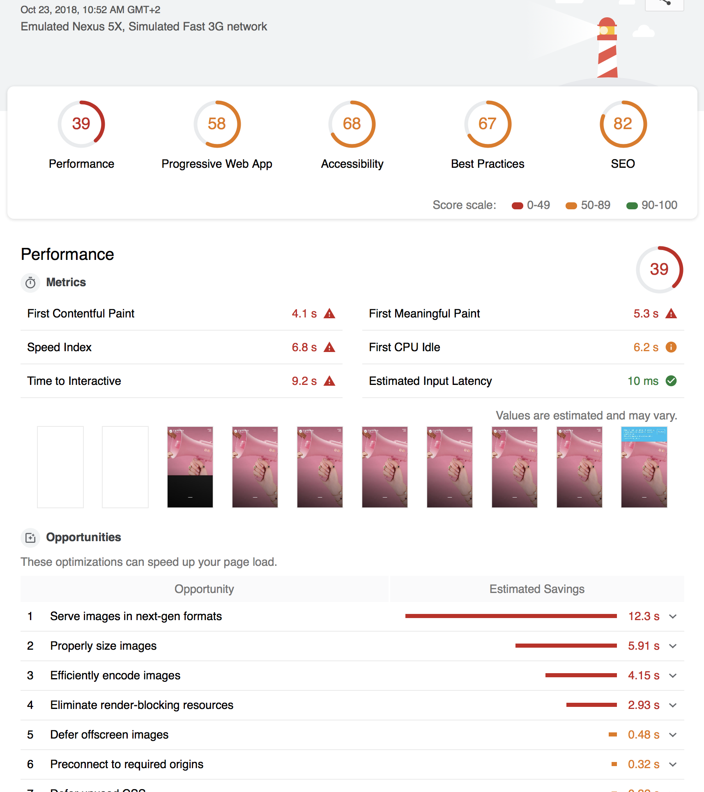
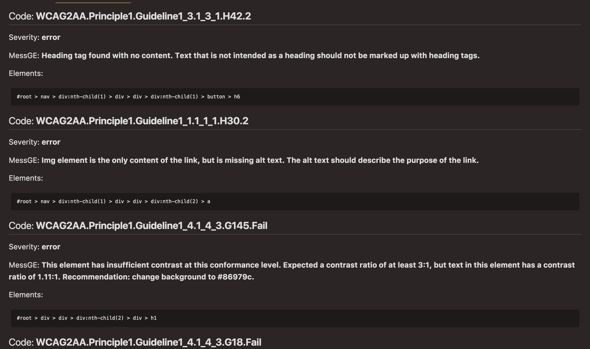

# 📈 Siteaudit: Generate audit benchmark for your site 📈

Siteaudit will analize your site and generate audit for:

- Pagespeed
- Lighthouse
- A11y


## Installation

### **Use nodejs**

You can use `siteaudit` from your terminal using the npm package and run it as a binary

```sh
npm -g i siteaudit

siteaudit https://canellariccardo.it
```

### **Use docker**

You can also use the docker image to generate the reports

#### Passing no configuration

```sh
docker run -t \
-v "$(pwd)/.testoutput":"/app/output" \
thecreazy/siteaudit:latest \
https://canellariccardo.it \
--headless
```

#### Passing configuration

```sh
docker run -t \
-v "$(pwd)/.testoutput":"/app/output" \
-v "$(pwd)/.siteaudit.json":"/.siteaudit.json"
thecreazy/siteaudit:latest \
https://canellariccardo.it \
--no-lighthouse \
--config /.siteaudit.json \
--headless
```


## Runtime options

- `--output` specify the output directory (where your assets will be generated))
- `--config` specify a JSON file containing an extension to the configuration
- `--no-pagespeed` no pagespeed audit will be generated
- `--no-lighthouse` no lighthouse audit will be generated
- `--a11y` start a11y audit
- `--headless` use chrome headless


## Using ENV

You can also using enviroments for passing the options

- `SITEAUDIT_NOLIGHTHOUSE` no lighthouse audit will be generated
- `SITEAUDIT_NOPAGESPEED` no pagespeed audit will be generated
- `SITEAUDIT_CONFIG` specify a JSON file containing an extension to the configuration
- `SITEAUDIT_URL` pass the url for running the audit
- `SITEAUDIT_A11Y` start a11y audit
- `SITEAUDIT_HEADLESS` use chrome headless
- `SITEAUDIT_USINGENV` force the use of the enviroments

## Configuration

If you pass to `siteaudit` an additional JSON file, it will be merged with initial config.

```sh
siteaduit https://canellariccardo.it --config ./config.json
```

Example:

```json
{
 "pagespeed": {
  "pages": [ "/", "/404" ]
 }
}
```

## Using in gitlab-ci

You can also use `siteaudit` in your gitlabci.yml

```yml
stages:
  - audit

audit:
  image: 
    name: thecreazy/siteaudit:1.1.4
    entrypoint: ['']
  stage: audit
  variables:
    SITEAUDIT_URL: "https://master.silvietta.n2.caffeina.host/"
  script:
    - echo "started siteaudit"
    - /usr/local/bin/siteaudit ${SITEAUDIT_URL} --headless
  artifacts:
    paths:
    - output
```

## Output

`siteaudit` will generate this output:

- `lighthouse-audit.html`: contains the classi html result of lighthouse
- `padespeed-audit.md`: a markdown format result of the pagespeed api
- `a11y-audit.md`: a markdown format result of the a11y api


### Output examples 





## Contributing

#### **Reporting bugs**

* Open a GitHub issue 

#### **Contributing with patches and bug fixes**

* Open a new GitHub pull request with the patch.
* Ensure the PR description clearly describes the problem and solution.


## Contributors

- Riccardo Canella [@thecreazy](https://github.com/thecreazy)


## License

MIT
